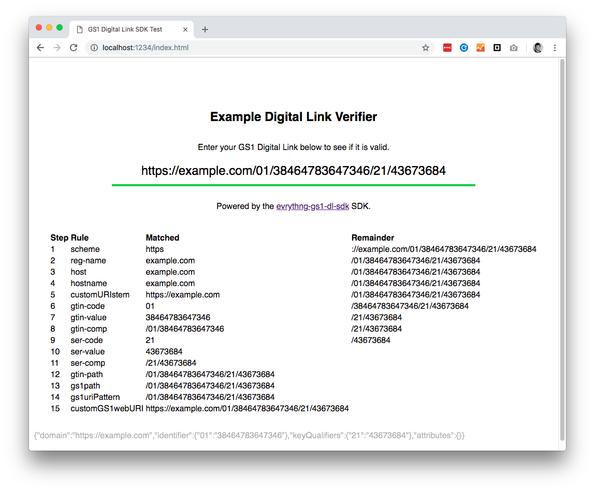

# digital-link.js

Javascript library for creating, verifying, and representing/transferring
[GS1 Digital Links](https://evrythng.com/news/upgrading-the-barcode-to-the-web-gs1-digital-link/).

This is the library powering the
[GS1 Digital Link Tools](https://digital-link.tools) project,
which allows easy generation and validation of GS1 Digital Links via a UI.

* [Installation](#installation)
* [Usage](#usage)
* [Test App](#test-app)
* [Utilities](#utilities)
* [Unit Tests](#unit-tests)


## Installation

### Node.js or bundler

Install via `npm`:

```bash
$ npm i --save digital-link.js
```

Then `require` it in code:

```js
const { DigitalLink, Utils } = require('digital-link.js');
```


### Script tag

Add a `<script>` tag to your HTML page:

```html
<script src="https://d10ka0m22z5ju5.cloudfront.net/js/digital-link.js/1.2.0/digital-link.js-1.2.0.js"></script>
```

Then access the `digitalLinkJs` global variable:

```js
const { DigitalLink, Utils } = digitalLinkJs;
```


## Usage

The `DigitalLink` object can be created in three ways - with options, using
setters, or an existing URL string. Either method of creation will produce
the same result.


### Create with object

The object can contain the following items:

- `domain` (string) - The domain to use.
- `identifier` (object) - An object containing a single GS1 Application
  Identifier, such as GTIN, as a key-value pair.
- `keyQualifiers` (object) - An object containing one or more GS1 Key Qualifiers
  as key-value pairs.
- `attributes` (object) - As for `keyQualifiers`, but containing GS1 Data
  Attributes and custom data attributes.

An example is shown below:

```js
const { DigitalLink } = require('digital-link.js');

const dl = DigitalLink({
  domain: 'https://dlnkd.tn.gg',
  identifier: {
    '01': '9780345418913',
  },
  keyQualifiers: {
    '21': '43786',
  },
  attributes: {
    thngId: 'UMwxDXBdUbxgtyRaR2HBrc4r',
  },
});
```


### Create with setters

The equivalent to the object-based example above can also be created
piecemeal using setters:

```js
const { DigitalLink } = require('digital-link.js');

const dl = DigitalLink();
dl.setDomain('https://dlnkd.tn.gg');
dl.setIdentifier('01', '9780345418913');
dl.setKeyQualifier('21', '43786');
dl.setAttribute('thngId', 'UMwxDXBdUbxgtyRaR2HBrc4r');
```

Setters can also be chained:

```js
const { DigitalLink } = require('digital-link.js');

const dl = DigitalLink()
  .setDomain('https://dlnkd.tn.gg')
  .setIdentifier('01', '9780345418913')
  .setKeyQualifier('21', '43786')
  .setAttribute('thngId', 'UMwxDXBdUbxgtyRaR2HBrc4r');
```


### Create from Web URI

A `DigitalLink` object can also be created using an existing string:

```js
const uri = 'https://dlnkd.tn.gg/01/9780345418913/21/43786';

const dl = DigitalLink(uri);
```


### Web URI and JSON Generation

A `DigitalLink` object can transform itself into a string Web URI representation:

```js
const uri = dl.toWebUriString();

console.log(uri);
```

It is also possible to view the object makeup of the `DigitalLink`. This can
then be used to construct the same `DigitalLink` from an object.

```js
// Get JSON representation
const jsonString = dl.toJsonString();
console.log(jsonString);

// Create DigitalLink using same data
const dl2 = DigitalLink(JSON.parse(jsonString));
```


### Digital Link Validation

Once created, the `DigitalLink` object can validate itself:

```js
const isValid = dl.isValid();

console.log(`Is the Digital Link valid? ${isValid}`);
```

You can also view the validation trace output at each match stage. Any remainder
after the last stage can be deemed erroneous, as it did not match any rule in
the grammar:

```js
const dl = DigitalLink('https://gs1.evrythng.com/01/9780345418913x');
const trace = dl.getValidationTrace();

console.log(trace);
```

The example above contains an erroneous 'x' at the end, so it does not validate:

```json
{
  "trace": [
    { "rule": "scheme", "match": "https", "remainder": "://gs1.evrythng.com/01/9780345418913x" },
    { "rule": "reg-name", "match": "gs1.evrythng.com", "remainder": "/01/9780345418913x" },
    { "rule": "host", "match": "gs1.evrythng.com", "remainder": "/01/9780345418913x" },
    { "rule": "hostname", "match": "gs1.evrythng.com", "remainder": "/01/9780345418913x" },
    { "rule": "customURIstem", "match": "https://gs1.evrythng.com", "remainder": "/01/9780345418913x" },
    { "rule": "gtin-code", "match": "01", "remainder": "/9780345418913x" },
    { "rule": "gtin-value", "match": "9780345418913", "remainder": "x" },
    { "rule": "gtin-comp", "match": "/01/9780345418913", "remainder": "x" },
    { "rule": "gtin-path", "match": "/01/9780345418913", "remainder": "x" },
    { "rule": "gs1path", "match": "/01/9780345418913", "remainder": "x" },
    { "rule": "gs1uriPattern", "match": "/01/9780345418913", "remainder": "x" },
    { "rule": "customGS1webURI", "match": "https://gs1.evrythng.com/01/9780345418913", "remainder": "x" }
  ],
  "success": false
}
```


### Compression

The
[GS1 Digital Link 1.1 draft specification](https://www.gs1.org/standards/gs1-digital-link)
describes a compression/decompression mechanism that allows for shorter URLs and
hence unlocks use cases where the size of the data carrier (e.g., QR code) is
very limited.

To create a compressed URI, use the `toCompressedWebUriString()` method:

```js
const uri = 'https://dlnkd.tn.gg/01/9780345418913/21/43786';
const dl = DigitalLink(uri);

const compressedUri = dl.toCompressedWebUriString();
```

To attempt decompression of a compressed URI use the constructor function as
usual:

```js
const compressedUri = 'https://dlnkd.tn.gg/DBHKVAdpQgqrCg';

const dl = DigitalLink(compressedUri);
```

> Note: decompression will fail if the result is not a valid GS1 Digital Link.

The `Utils` object also provides methods for direct compression and
decompression of URI strings:

```js
const { Utils } = require('digital-link.js');

const uri = 'https://dlnkd.tn.gg/01/9780345418913/21/43786';

// Compress a URI
const compressedUri = Utils.compressWebUri(uri);

// Compress without optimisations or compressing other key-value pairs
const useOptimisations = false;
const compressOtherKeyValuePairs = false;
const semiCompressedUri = Utils.compressWebUri(uri, useOptimisations, compressOtherKeyValuePairs);

// Decompress a compressed URI
const decompressedUri = Utils.decompressWebUri(compressedUri);

// Detect if a URI is compressed
const isCompressed = Utils.isCompressedWebUri(compressedUri);
```


## Test App



The `test-app` directory contains a simple app built with
[Hyperapp](https://github.com/jorgebucaran/hyperapp) that demonstrates how to
easily build a simple GS1 Digital Link verification tool using this SDK.

To use it:

1. `cd test-app && npm i`
2. `npm run serve`
3. Open `http://localhost:1234/index.html` in a browser of choice.
4. Enter or type a GS1 Digital Link, and observe the validity.

The trace steps (which matched a parser rule) are also shown, allowing you to
see which parts of your input did not match any rule. The output of
`toJsonString()` is also shown as an insight into the make-up of the URL itself.


## Utilities

Since this library is based on
[`apglib`](https://github.com/ldthomas/apg-js2-lib), it can do more than simply
validate GS1 Digital Link URLs. The `Utils` object allows a single Application
Identifier to be validated (as well as a whole canonical URL). All available
individual rules are available from the `Rules` object

For example, validating a GTIN by itself:

```js
const { Utils } = require('digital-link.js');

// Validate a GTIN
const gtin = '438948397';
const rule = Utils.Rules.gtin;

console.log(`Is the GTIN ${gtin} valid? ${Util.testRule(rule, gtin)}`);
```

It also allows generation of simple HTML tables that detail the results of the
parser run against the input:

```js
const { DigitalLink, Utils } = require('digital-link.js');

const dl = DigitalLink('https://gs1.evrythng.com/01/9780345418913');

// See all the parser trace steps for a given DigitalLink URL
traceSpan.innerHTML = Utils.generateTraceHtml(dl.toUrlString());

// See all the parser stats for a given DigitalLink URL
statsSpan.innerHTML = Utils.generateStatsHtml(dl.toUrlString());

// See all the parser results for a given DigitalLink URL
resultsSpan.innerHTML = Utils.generateResultsHtml(dl.toUrlString());
```

### ABNF Grammar

The generation of this tool is based on the standard's ABNF grammar.
The grammar files corresponding to each version of the standard can be found in
the `grammar` folder.

## Unit Tests

Unit tests can be run with the `npm test` command, and cover all methods,
creation methods, and output formats.

## Third party libraries

`digital-link.js` was built using some great third party libraries, in
particular:

* [`apglib`](https://github.com/ldthomas/apg-js2-lib) - which is used to verify
  links based on the standard `ABNF` grammar.
* [`GS1DigitalLinkCompressionPrototype`](https://github.com/gs1/GS1DigitalLinkCompressionPrototype) -
  which is a prototype implementation of the Digital Link compression as
  specified in the GS1 Digital Link 1.1 draft specification.


## Deployment

See `jenkins` for deployment instructions.
